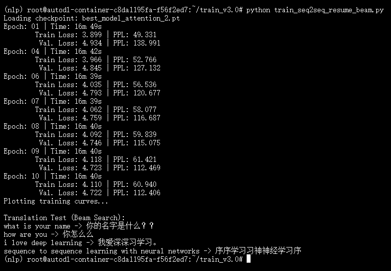
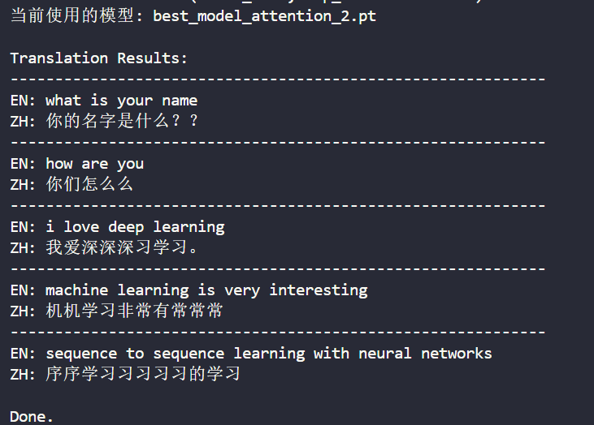
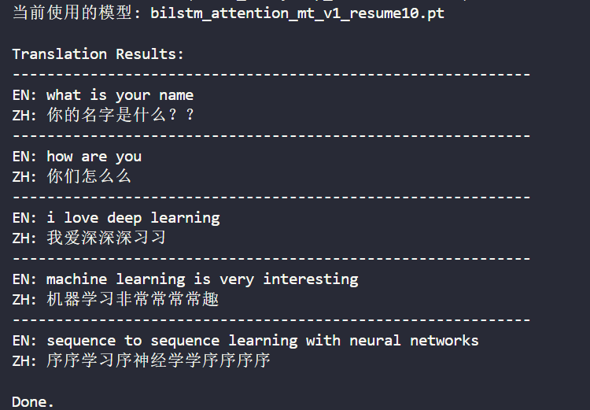
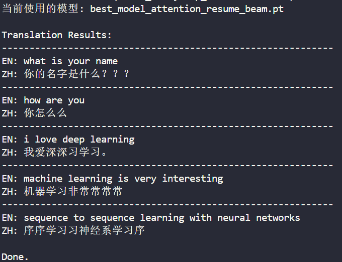

# train_v2.0

## 项目概述 🔍
这是第二轮训练（在 v1.0 的基础上改进），在功能上做了多次迭代：加入专门的预处理脚本以缓解服务器 CPU 瓶颈、提供从头训练与继续训练（resume）两种流程，并加入 beam search 的训练/评估变体以期望提升翻译质量。

## 文件结构与说明 📁
- `preprocess.py`：主预处理脚本。将原始文本数据转为模型输入的张量并保存到 `preprocessed_attention_data/`。使用预处理是为了解决服务器上的 **CPU 瓶颈**（训练时避免重复进行昂贵的文本处理）。
- `preprocessed.py`：预处理的辅助/备用脚本（根据代码可实现不同的预处理流程）。
- `train_seq2seq.py`：**从头训练** 的基本训练脚本（用作第一阶段训练）。
- `train_seq2seq_resume.py`：**在已有训练好的模型基础上继续训练（resume）** 的脚本，用于在原模型上继续优化。
- `train_seq2seq_beam.py`：**从头训练并在训练过程中使用 beam search** 的版本（beam search 被用于生成策略的变体）。
- `train_seq2seq_resume_beam.py`：**在已有训练模型上加入 beam search 后继续训练 10 轮**（将 resume 与 beam 结合）。这是本项目最后采用的训练脚本，训练结果见 `train_seq2seq_resume_beam_output.png`。
- `test_seq2seq.py`：用于评估/测试模型的脚本。
- 若干 checkpoint / best model：`best_model_attention*.pt`, `bilstm_attention_mt_v1_resume10.pt` 等。
- 训练日志/输出：`train_seq2seq_output.txt`, `train_seq2seq_resume_output.txt`（分别对应训练脚本的输出记录）。
- `preprocessed_attention_data/`：存放 `train_data.pt`, `dev_data.pt`, `en2id.pt`, `zh2id.pt` 等预处理后的数据文件，供训练/验证加载使用。

## 训练改进流程说明 🔁
1. **先用 `train_seq2seq.py` 训练（从头）**，作为基础模型训练步骤。 
2. 若基础模型效果未达预期，使用 **`train_seq2seq_resume.py` 在已训练好的模型基础上继续训练（resume）** 来进一步优化模型权重。 
3. 如果继续训练后仍不够理想，尝试 **`train_seq2seq_resume_beam.py`**：即在已有模型上加入 beam search，再训练 10 轮（此脚本为最终采用的训练方式）。 
4. `train_seq2seq_beam.py` 是另一种策略：**从头训练且引入 beam search**，用于对比从头使用 beam 与在已有模型上加入 beam 的差异。

**最终采用的训练脚本：** `train_seq2seq_resume_beam.py`。训练性质和结果可以在 `train_seq2seq_resume_beam_output.png` 中查看；对应训练日志保存在 `.txt` 文件中。

## 使用建议 / 快速复现流程 ✅
1. 运行预处理：
   - `python preprocess.py` → 生成 `preprocessed_attention_data/*`。
2. 选择训练流程：
   - 从头训练：`python train_seq2seq.py`；
   - 继续训练（基于已有模型）：`python train_seq2seq_resume.py`；
   - 在已有模型基础上加入 beam 并继续训练（推荐复现最终结果）：`python train_seq2seq_resume_beam.py`。
3. 评估/测试：使用 `test_seq2seq.py` 以及保存的 checkpoint 进行推理评估。

## 结果示例 🧾
下面给出本次最终采用训练脚本 `train_seq2seq_resume_beam.py` 的训练结果示例（图片与训练日志）：

  

  
  &nbsp;&nbsp;
  
  &nbsp;&nbsp;
  

  <strong>image01</strong>：`best_model_attention_2.pt` &nbsp;&nbsp;|&nbsp;&nbsp; <strong>image02</strong>：`bilstm_attention_mt_v1_resume10.pt` &nbsp;&nbsp;|&nbsp;&nbsp; <strong>image03</strong>：`best_model_attention_resume_beam.pt`

**训练日志（可点击查看）：**

- [train_seq2seq_output.txt](train_seq2seq_output.txt) — `train_seq2seq.py` 的训练输出（从头训练）。
- [train_seq2seq_resume_output.txt](train_seq2seq_resume_output.txt) — `train_seq2seq_resume.py` 的训练输出（继续训练）。

**图片说明（`images/`）📷**

- `images/image01.png` — 对 `best_model_attention_2.pt`（由 `train_seq2seq.py` 从头训练）模型的测试/结果示例。
- `images/image02.png` — 对 `bilstm_attention_mt_v1_resume10.pt`（由 `train_seq2seq_resume.py` 继续训练得到）模型的测试/结果示例。
- `images/image03.png` — 对 `best_model_attention_resume_beam.pt`（由 `train_seq2seq_resume_beam.py` 训练并最终采用）模型的测试/结果示例。

## 模型与来源 🗂️
下面列出仓库中保存的主要 checkpoint 及其对应的训练脚本/来源：

- `best_model_attention_2.pt` — 在 `train_seq2seq.py`（从头训练）中保存（当验证损失达到新低时）。
- `bilstm_attention_mt_v1_resume10.pt` — 在 `train_seq2seq_resume.py`（在已有模型基础上继续训练 10 轮）中保存。
- `best_model_attention_resume_beam.pt` — 在 `train_seq2seq_resume_beam.py`（在已有模型上加入 beam search 并继续训练）中保存；这是本项目**最终采用**的模型。
- `best_model_attention.pt` — 由早期训练（笔记本/旧脚本）保存的基线 checkpoint，可作为对照。

下面给出已保存 checkpoint 的详细训练信息（用于复现与记录）：

| Checkpoint 文件 | 生成脚本 | Batch Size | Epochs（训练轮数） | Learning Rate | 每 epoch 时间（日志/平均） | 最佳验证 Loss / PPL（可用日志） | 文件生成时间 |
|---|---:|:---:|:---:|:---:|:---:|:---:|---:|
| `best_model_attention_2.pt` | `train_seq2seq.py`（从头训练） | 128 | 10 | 3e-4 | 约 16-17 分钟/epoch | Val Loss 最小约 **4.732**（见 `train_seq2seq_output.txt`） | 2025-12-15 18:13:57 |
| `bilstm_attention_mt_v1_resume10.pt` | `train_seq2seq_resume.py`（在已有模型基础上继续训练 10 轮） | 128 | 10（额外） | 1e-4 | 约 16-17 分钟/epoch | Val Loss 最小约 **4.722**（见 `train_seq2seq_resume_output.txt`） | 2025-12-15 21:32:29 |
| `best_model_attention_resume_beam.pt` | `train_seq2seq_resume_beam.py`（在已有模型上加入 beam search 并继续训练 10 轮，最终采用） | 128 | 10（额外） | 1e-4 | 约 16-17 分钟/epoch |（验证曲线见 `train_seq2seq_resume_beam_output.png`／`images/training_curves.png`） | 2025-12-16 01:01:24 |

